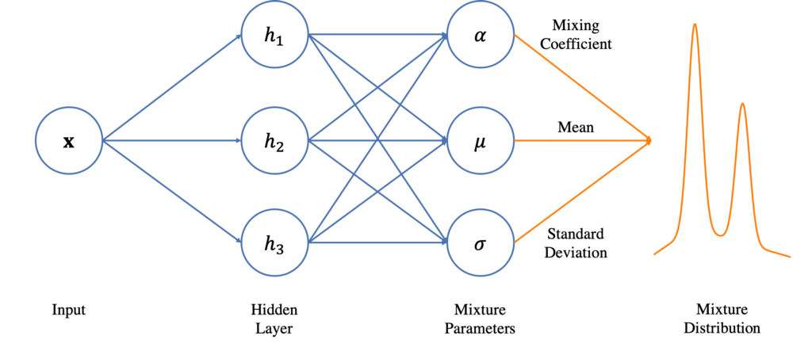
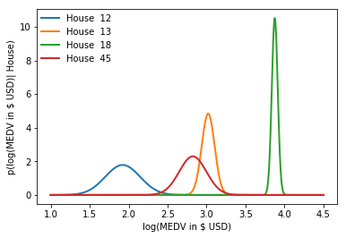
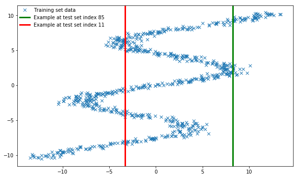
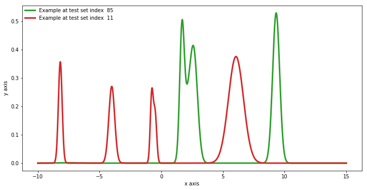

# mixture_net

[](https://circleci.com/gh/aa-generali-italia/mixture_net)

A Tensorflow implementation of the Mixture Density Networks model (Bishop)



Load the Boston housing dataset using Scikit APIs:

```python
from sklearn.model_selection import train_test_split
from sklearn.preprocessing import MinMaxScaler
from sklearn.datasets import load_boston
import numpy as np

boston = load_boston()
x_data = boston.data
y_data = np.log(boston.target)[:, np.newaxis].astype(np.float32)

x_train, x_test, y_train, y_test = train_test_split(x_data, y_data, test_size=0.3, random_state=42, shuffle=True)

min_max_scaler = MinMaxScaler()

x_train = min_max_scaler.fit_transform(x_train) 
x_test = min_max_scaler.transform(x_test) 
```

Train the network on Boston housing data (should not take long, less than a minute):

```python
from mixture_net.model import MDN
from mixture_net.losses import gnll_loss
from mixture_net.utils import nnelu, register_custom_activation
import tensorflow as tf
from tensorflow.keras.callbacks import EarlyStopping


no_parameters = 3
components = 1
neurons = 200

opt = tf.train.AdamOptimizer(1e-3)
mon = EarlyStopping(monitor='val_loss', min_delta=0, patience=5, verbose=0, mode='auto')

register_custom_activation('nnelu', nnelu)   # Sorry, need to register the custom activation function (nnelu)
net = MDN(neurons=neurons, components=components)
net.compile(loss=gnll_loss(no_parameters, components), optimizer=opt, callbacks=[mon])
net.fit(x=x_train, y=y_train, epochs=100, batch_size=128)
```

Now plot prediction results:

```python
%matplotlib inline
import matplotlib.pyplot as plt
from mixture_net.utils import slice_parameter_vectors
from tensorflow_probability import distributions as tfd
import seaborn as sns

def plot_house(ax, index, col_index):
    alpha, mu, sigma = slice_parameter_vectors(net.predict([x_test[index].reshape(1,-1)]), components, no_parameters)

    gm = tfd.MixtureSameFamily(
            mixture_distribution=tfd.Categorical(probs=alpha),
            components_distribution=tfd.Normal(
                loc=mu,       
                scale=sigma))
    
    with tf.Session() as sess:
        pyx = gm.prob(x).eval()
    
    ax.plot(x,pyx,alpha=1, color=sns.color_palette()[col_index], linewidth=2, label="House {:3d}".format(index))
    
    
x = np.linspace(1,4.5,int(1e3))

fig = plt.figure()
ax = plt.gca()

plot_house(ax, 12, 0)
plot_house(ax, 13, 1)
plot_house(ax, 18, 2)
plot_house(ax, 45, 3)

ax.set_xlabel("log(MEDV in $ USD)")
ax.set_ylabel("p(log(MEDV in $ USD)| House)")

ax.legend(loc=0, borderaxespad=0.1, framealpha=1.0, fancybox=True, ncol=1, shadow=True, frameon=False)
    
plt.show()
```



## A (difficult) synthetic example
```python
import numpy as np
from sklearn.model_selection import train_test_split

N = 1000
y_data = np.random.uniform(-10.5, 10.5, N)
r_data = np.random.normal(size=N)  # random noise
x_data = np.sin(0.75 * y_data) * 7.0 + y_data * 0.5 + r_data * 1.0
x_data = x_data.reshape((N, 1))
x_train, x_test, y_train, y_test = train_test_split(x_data, y_data, test_size=0.25)
```
This is what the function looks like (the green and red lines refer to two examples from the test set that will be shown as density distributions in another plot below):



The mixture_net model was trained using 6 components and the standard network architecture found the 'Model' module.
(Plotting code is similar to what reported for Boston housing dataset).
And this is what the model predicts for the two points selected above (green and red lines correspondance is retained):


